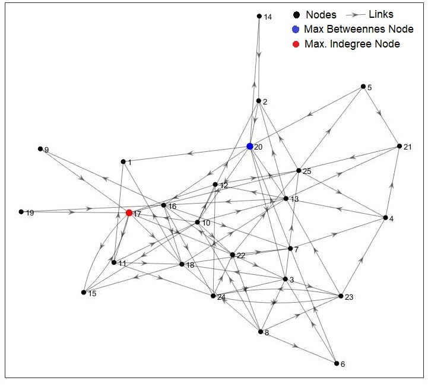

# Supply-chain Network Analysis

This repository contains files associated with analysis done as part of research collaboration with researchers from Supply-chain management 
at the Sam M. Walton College of Business. 

This research collaboration is motivated by recent articles [1](https://www.emeraldinsight.com/doi/full/10.1108/01443571311307343),
[2](https://www.tandfonline.com/doi/abs/10.1080/00207540500142274) that Supply-Networks are qualitatively similar to the complexnetworks.
Here is an example of 25 companies supply-network.

The supply-chain networks are created from supply relation data obtained from data source called FactSet. We created tier-wise supply network graphs for focal companies. See [Creating Supply-Network Graphs](https://github.com/ViditAg/SupplyNetwork_Analysis/blob/master/Creating_SupplyNetworkGraphs.pdf) for detailed steps. See 
[4 Tier supply-network]
(https://github.com/ViditAg/SupplyNetwork_Analysis/blob/master/SupplyNetwork_4Tiers.pdf) and 

[Full supply-network]
(https://github.com/ViditAg/SupplyNetwork_Analysis/blob/master/SupplyNetwork_AllTiers.pdf) for example plots

The two main ideas that we have work on so far are listed below. Both of them are written as manuscripts are under review with the journals.

### Analysts are able to produce more accurate cost forecasts if a firm has a supply network with scale-free characteristics.

### When Partners Become Difficult: Relational Strain and Distant Tie Formation in Interorganizational Networks
